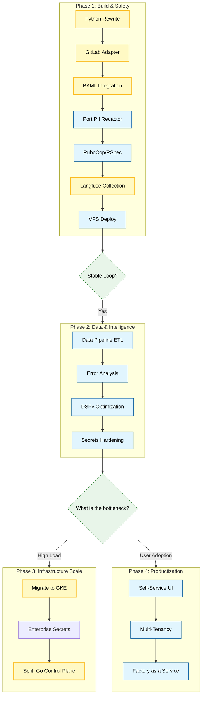

# The Factory: Execution Strategy

**Objective:** Build a scalable, AI-native coding platform.
**Philosophy:** Python-first for AI, Monolith for velocity, K8s for scale.

## 🗺️ Milestone Roadmap

---

## 🛠️ Tactical Steps

### Phase 1: Build & Safety (The Factory v1)
*Goal: Deploy a secure, functional agent tailored for Avvoka's stack.*
1.  **Rewrite:** Python (FastAPI + Arq).
2.  **Safety First:** Port **PII Redactor** immediately. No data leaves without sanitization.
3.  **Integration:** GitLab API Adapter + **BAML** for strict contracts.
4.  **Validation:** `rubocop` and `rspec` runners.
5.  **Observability:** **Langfuse** acts as the "Black Box", recording every trace for Phase 2.
6.  **Deploy:** Simple VPS (Docker Compose).

### Phase 2: Data & Intelligence (The Brain)
*Goal: Use collected data to optimize performance and cost.*
1.  **Data Pipeline:** Build an ETL process to analyze Langfuse traces (Success Rate, Latency).
2.  **Optimization:** Apply **DSPy** to optimize prompts based on real-world failure patterns from Phase 1.
3.  **Hardening:** Move secrets to Doppler, refine PII regexes based on logs.

### Phase 3: Infrastructure Scale (Conditional)
*Trigger: When VPS hits performance limits.*
1.  **Infrastructure:** Migrate to **GKE**.
2.  **Architecture:** Rewrite Control Plane to **Go**.

### Phase 4: Productization (Parallel Track)
*Trigger: When we need to empower non-technical users.*
1.  **UI:** Build a Self-Service Portal (Next.js/Retool).
2.  **Product:** Prepare for "Factory as a Service".

---

## 🧠 Decision Log

| Decision | Choice | Reasoning |
| :--- | :--- | :--- |
| **Language** | **Python** | Native support for BAML, DSPy, LangChain. |
| **Infra (Day 1)** | **VPS** | Fastest time-to-value. Matches current Ops skills. |
| **Infra (Day 100)** | **GKE** | Required for elastic scaling of ephemeral agents. |
| **Safety** | **Deterministic** | Regex/Linter > LLM Judges. |