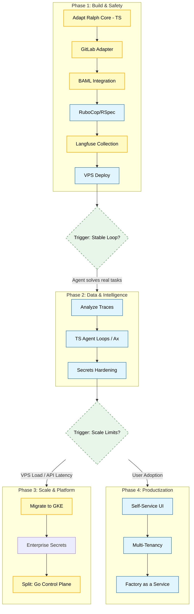

# The Factory: Execution Strategy (TypeScript Native)

**Objective:** Build a scalable, AI-native coding platform.
**Philosophy:** TypeScript for Agents (Velocity & Type Safety), Go for Control Plane (Scale).

---

## 🚦 Strategic Alignment

### ✅ Decision Gate 1: The Stack -> **TypeScript Native**
*   **Reasoning:** While Python dominates the experimental AI ecosystem, **TypeScript** provides superior production ergonomics for I/O-heavy orchestration (Git, Linters, APIs).
*   **Structured Output:** We will use **BAML's native TS client** to guarantee type-safe LLM outputs without runtime overhead.
*   **Agentic Loops:** We will rely on explicit, "vanilla" TS control flow (or lightweight frameworks like `Ax` for ReAct) instead of black-box Python frameworks. Heavy prompt optimization (DSPy MIPRO) can be run as an *offline* Python process if needed, injecting the resulting optimized prompts back into the TS agents.

### 🛑 Decision Gate 2: The Infrastructure -> **VPS to GKE**
*   **Decision:** Start with **Docker Compose on VPS** for immediate ROI, but design stateless workers ready for a fast-follow migration to **GKE**.

---

## 🗺️ Milestone Roadmap

---

## 🛠️ Tactical Steps

### Phase 1: Build & Safety (The Factory v1)
*Goal: A fully observable and safe loop tailored for Avvoka.*
1.  **Adaptation:** Utilize the existing Ralph TS monorepo (PII Redactor already implemented).
2.  **Integration:** Implement GitLab API calls for issue ingestion and MR creation.
3.  **Structure:** Generate **BAML TypeScript client** for strict JSON outputs.
4.  **Validation:** Add `rubocop` and `rspec` execution loops.
5.  **Observability:** **Langfuse Collection** for all AI actions.
6.  **Deploy:** Docker Compose on VPS.

### Phase 2: Data & Intelligence (The Brain)
*Goal: Make the agent smarter without sacrificing transparency.*
1.  **Data Pipeline:** Build an ETL process to analyze Langfuse traces.
2.  **Agentic Logic:** Implement ReAct or Self-Correction loops natively in TS (or via `Ax`), based on trace data.
3.  **Security:** Move secrets to Doppler.

### Phase 3: Scale & Platform (The Beast)
*Trigger: VPS CPU/Memory limits hit due to parallel agent executions.*
1.  **Infrastructure:** Migrate workloads to **GKE**.
2.  **Architecture Split:** Rewrite the Orchestrator (API/Queue) to **Go** for maximum concurrency. Extract TS Agents into ephemeral Kubernetes Jobs.

### Phase 4: Productization (Parallel Track)
*Trigger: Need to empower non-technical users.*
1.  **UI:** Build a Self-Service Portal (Next.js).
2.  **Isolation:** Enforce strict team boundaries.
3.  **Product:** Prepare for "Factory as a Service".