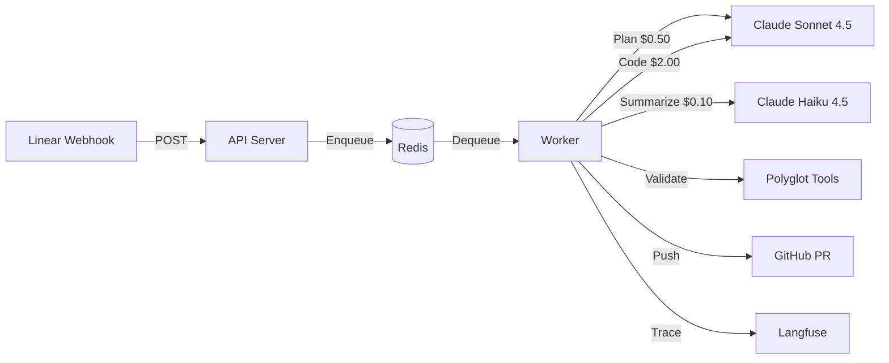

# Ralph - AI Coding Agent Platform

Ralph is an event-driven AI coding agent that automatically processes Linear issues, generates implementation plans, validates code with polyglot toolchains, and creates pull requests on GitHub.

## 🎯 What is Ralph?

Ralph automates the software development workflow by:
- **Planning** with Claude Sonnet 4.5 (implementation plans with $0.50 budget limit)
- **Coding** with Claude Sonnet 4.5 (code execution with $2.00 budget limit)
- **Error Summarization** with Claude Haiku 4.5 (cost-efficient failure analysis with $0.10 budget)
- **Validating** with polyglot tools (Biome, TSC, Ruff, Mypy, Trivy)
- **Iterating** based on human feedback and CI results

## ✨ Key Features

- **Human-in-the-Loop Planning** - Review and approve implementation plans before code execution
- **PR Iteration Workflow** - Continuously improve PRs with CI/SonarQube feedback
- **Multi-Repository Support** - Map Linear teams to different GitHub repositories
- **Polyglot Validation** - Auto-detect and validate TypeScript, JavaScript, and Python projects
- **Cost-Optimized** - Budget limits per phase, Haiku for summaries, TOON format for token reduction
- **Security-First** - Command allowlists, sandbox isolation, secret scanning
- **Observable** - Full tracing with Langfuse

## 🚀 Quick Start

### Local Development

```bash
# Clone and setup
git clone https://github.com/Replikanti/ralph-platform.git
cd ralph-platform
cp .env.example .env
# Edit .env with your API keys

# Start the stack
docker-compose up --build

# Run tests
npm test
```

For local webhook testing, use [ngrok](https://ngrok.com/): `ngrok http 3000`

### Production Deployment

See **[DEPLOYMENT.md](./DEPLOYMENT.md)** for complete GCP/Kubernetes setup with Terraform.

## 📚 Documentation

| Document | Description |
|----------|-------------|
| **[ARCHITECTURE.md](./ARCHITECTURE.md)** | Technical architecture, components, workflow diagrams |
| **[DEPLOYMENT.md](./DEPLOYMENT.md)** | GCP deployment, Terraform, Kubernetes, infrastructure |
| **[USER_GUIDE.md](./USER_GUIDE.md)** | How to use Ralph, workflows, examples |
| **[CLAUDE.md](./CLAUDE.md)** | Instructions for Claude Code when working on Ralph's codebase |

## 🔄 Workflows

Ralph supports three distinct workflows:

### 1. Human-in-the-Loop Planning (Default)
```
Create Linear Issue → Ralph Plans → Human Reviews → Approves → Ralph Implements → Creates PR
```

### 2. PR Iteration Workflow
```
PR Created → CI Fails → Comment Feedback → Ralph Plans Fix → Approves → Pushes to Same PR
```

### 3. Legacy Mode (Plan + Execute)
```
Create Linear Issue → Ralph Plans + Implements → Creates PR
```

See **[ARCHITECTURE.md](./ARCHITECTURE.md)** for detailed workflow diagrams.

## 🎮 Basic Usage

### 1. Create a Linear Issue

- Add label: **"Ralph"**
- Write clear description of the task
- Ralph automatically starts working

### 2. Review the Plan

- Ralph posts implementation plan as comment
- Issue moves to "plan-review" state
- Reply with:
  - **"LGTM"** / **"approved"** → Ralph implements
  - **Feedback** → Ralph revises plan

### 3. Iterate on PR (Optional)

- After PR creation, comment on ticket with improvements
- Examples: "fix CI errors", "refactor per SonarQube"
- Ralph creates iteration plan → approve → pushes fix

See **[USER_GUIDE.md](./USER_GUIDE.md)** for complete examples and best practices.

## 🛠️ Development

```bash
# Build
npm run build

# Run tests
npm test

# Run specific test
NODE_OPTIONS=--experimental-vm-modules npx jest tests/server.test.ts

# Start services
npm run start:api      # API on port 3000
npm run start:worker   # Background worker
```

## 🔐 Environment Variables

```bash
# Required
REDIS_URL=redis://localhost:6379
GITHUB_TOKEN=ghp_xxx                    # Requires 'repo' scope
ANTHROPIC_API_KEY=sk-ant-xxx
LINEAR_WEBHOOK_SECRET=xxx               # From Linear webhook settings

# Required for Plan Review
LINEAR_API_KEY=lin_api_xxx              # Write access to Linear

# Optional
PLAN_REVIEW_ENABLED=true                # Enable human-in-the-loop (default: true)
PLAN_TTL_DAYS=7                         # Redis plan TTL (default: 7)
LANGFUSE_SECRET_KEY=sk-lf-xxx           # Observability
LANGFUSE_PUBLIC_KEY=pk-lf-xxx
LANGFUSE_HOST=https://cloud.langfuse.com
DEFAULT_REPO_URL=https://github.com/org/repo  # Fallback repo
LINEAR_TEAM_REPOS={"TEAM":"https://github.com/org/repo"}
```

## 🏗️ Architecture Overview



See **[ARCHITECTURE.md](./ARCHITECTURE.md)** for detailed component architecture.

## 🔒 Security

Ralph implements multiple security layers:

- **Command Allowlist** - Only whitelisted commands can execute
- **Sandbox Isolation** - Each task runs in isolated workspace
- **Secret Scanning** - Trivy scans for exposed secrets
- **Webhook Authentication** - HMAC SHA-256 signature verification
- **Resource Limits** - Timeout, memory, and output size limits

⚠️ **Important**: Ralph can execute code from `package.json` scripts and Python test configs. Only use with trusted repositories. See **[ARCHITECTURE.md](./ARCHITECTURE.md#security)** for detailed security model.

## 📊 Monitoring

Ralph integrates with:

- **BullMQ Dashboard** - Queue monitoring at `/admin/queues`
- **Langfuse** - Full LLM observability and tracing
- **Kubernetes Metrics** - Resource usage and health checks

## 🤝 Contributing

Ralph is **self-evolving**. When adding features or fixing bugs in Ralph's own codebase, Ralph is authorized to modify `src/` files directly.

See **[CLAUDE.md](./CLAUDE.md)** for development guidelines.

## 📄 License

MIT

## 🔗 Links

- [GitHub Repository](https://github.com/Replikanti/ralph-platform)
- [Linear Integration Guide](./USER_GUIDE.md#linear-setup)
- [GCP Deployment Guide](./DEPLOYMENT.md)
- [Architecture Deep Dive](./ARCHITECTURE.md)
