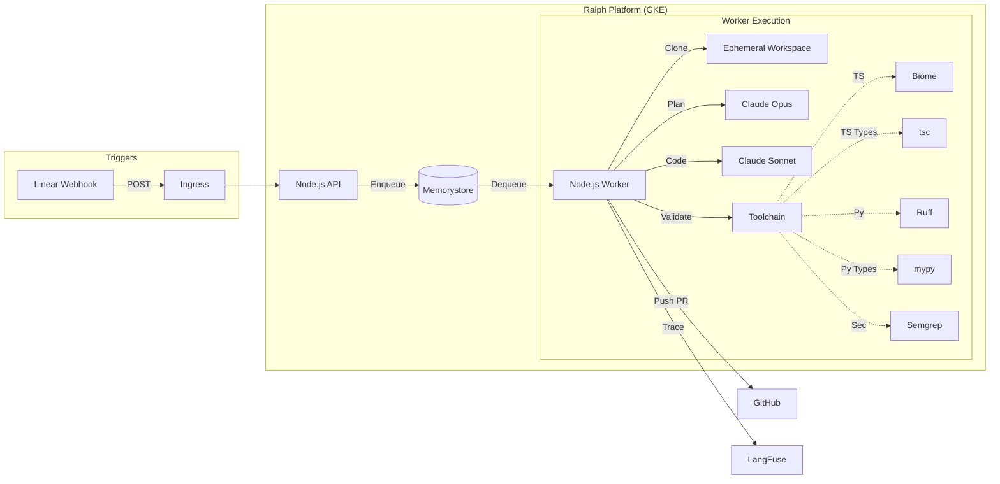

# Ralph - AI Coding Agent Platform

Ralph is an event-driven AI coding agent orchestrated on Google Kubernetes Engine (GKE). It autonomously picks up tasks from Linear, plans implementation, writes code, validates it using a robust toolchain, and pushes a Pull Request to GitHub.

## Architecture

1.  **Trigger**
    A Linear webhook sends issue events to the Ralph API. Events are filtered; only issues with the "Ralph" label are processed. The webhook signature is verified using HMAC-SHA256.

2.  **Queue**
    Valid tasks are enqueued in Redis (Google Memorystore). The system uses BullMQ for robust job processing, including retries and exponential backoff.

3.  **Execution (Worker)**
    A Node.js worker picks up the job and performs the following:
    *   **Clone**: Creates an ephemeral workspace and clones the target repository.
    *   **Plan**: Uses Claude 3 Opus to analyze the request and formulate a plan.
    *   **Code**: Uses Claude 3.5 Sonnet to implement the plan.
    *   **Validate**: Runs a polyglot toolchain (Biome, Ruff, Mypy, TSC, Semgrep) to ensure code quality and security.
    *   **Push**: Commits changes and pushes a new branch to GitHub.



## Local Development

1.  **Environment Setup**
    Copy the example environment file and configure your keys.
    ```bash
    cp .env.example .env
    ```

2.  **Start Services**
    Run the complete stack (Redis, API, Worker) using Docker Compose.
    ```bash
    docker-compose up --build
    ```

3.  **Run Tests**
    Execute the test suite to verify functionality.
    ```bash
    npm test
    ```

## Production Deployment Guide

This guide describes how to deploy the complete platform from scratch to Google Cloud.

### Prerequisites

*   Google Cloud Platform (GCP) project.
*   Terraform CLI installed.
*   GitHub Personal Access Token (PAT) with `repo` and `workflow` scopes.
*   Domain name managed by Cloud DNS or an external provider.

### 1. Infrastructure Provisioning (Terraform)

We use Terraform to provision GKE, Redis Memorystore, VPC networking, and configure Workload Identity Federation for GitHub Actions.

1.  Navigate to the infrastructure directory.
    ```bash
    cd infra
    ```

2.  Initialize Terraform.
    ```bash
    terraform init
    ```

3.  Apply the configuration. You must provide your GCP project ID and GitHub credentials.
    ```bash
    terraform apply \
      -var="project_id=YOUR_PROJECT_ID" \
      -var="github_owner=YOUR_GITHUB_ORG" \
      -var="github_token=YOUR_GITHUB_PAT"
    ```

    **What this does:**
    *   Creates a private GKE cluster and a Redis Memorystore instance.
    *   Configures VPC peering and Cloud NAT.
    *   Sets up a Service Account and Workload Identity Federation.
    *   **Automatically populates GitHub Secrets** in your repository with the necessary GCP credentials.

### 2. CI/CD Deployment

Once Terraform completes, the CI/CD pipeline is ready.

1.  Push your code to the `main` branch.
2.  GitHub Actions will automatically trigger the `Deploy to GKE` workflow.
3.  This workflow builds the Docker image, pushes it to Google Container Registry (GCR), and deploys the Helm chart to your new GKE cluster.

### 3. Application Secrets Configuration

The automated pipeline deploys the application, but the pods will fail to start until the required application secrets are present in the cluster. You must create these manually once.

1.  Connect to your GKE cluster.
    ```bash
    gcloud container clusters get-credentials ralph-cluster --region europe-west1
    ```

2.  Create the Kubernetes Secrets.

    ```bash
    # GitHub Token (for cloning repos)
    kubectl create secret generic ralph-github-token --from-literal=token=YOUR_GITHUB_TOKEN

    # Anthropic API Key (for LLM inference)
    kubectl create secret generic ralph-anthropic-key --from-literal=key=YOUR_ANTHROPIC_KEY

    # Linear Webhook Signing Secret (from Linear settings)
    kubectl create secret generic ralph-linear-secret --from-literal=webhook-secret=YOUR_LINEAR_SIGNING_SECRET

    # Langfuse Configuration (optional, for tracing)
    kubectl create secret generic ralph-langfuse \
      --from-literal=secretKey=YOUR_LF_SECRET \
      --from-literal=publicKey=YOUR_LF_PUBLIC \
      --from-literal=host=https://cloud.langfuse.com

    # Redis Connection (Use the IP output from Terraform)
    kubectl create secret generic ralph-redis-secret --from-literal=redis-url=redis://10.X.X.X:6379
    ```

### 4. Final Configuration

1.  **DNS**: Get the external IP of the Ingress and configure your domain's A record.
    ```bash
    kubectl get ingress
    ```

2.  **Linear Webhook**:
    *   Go to Linear Settings -> API -> Webhooks.
    *   Create a new webhook pointing to `https://your-domain.com/webhook`.
    *   Select "Issues" events.
    *   Copy the "Signing Secret" and update the Kubernetes secret created in step 3.

The platform is now fully operational.