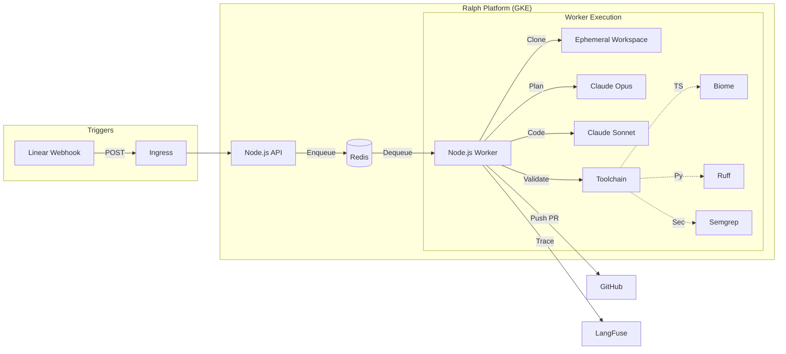

# Ralph - AI Coding Agent Platform

Ralph is an event-driven AI coding agent orchestrated on GKE.

## Architecture



## Linear Integration & Automation

### 1. Webhook Configuration
To enable Ralph to receive tasks automatically from Linear:
1.  Go to **Linear -> Settings -> API -> Webhooks**.
2.  Create a new Webhook.
3.  **URL**: Set this to your Ralph API endpoint (e.g., `https://ralph.your-domain.com/webhook` or your `ngrok` URL for local testing).
4.  **Events**: Enable `Issues` (Create and Update).

### 2. Workflow Logic
Ralph filters incoming webhooks based on labels. Only issues with the **"Ralph"** label (case-insensitive) will be processed.

### 3. Status Transitions (Planned)
The current version focuses on the coding agent workflow. To enable automatic status transitions (e.g., moving an issue to "In Progress" when starting and "Done" after a successful push):
1.  Obtain a **Linear API Key** from Settings.
2.  Add `LINEAR_API_KEY` to your environment variables.
3.  Ralph can then be extended to use the `@linear/sdk` to update the `stateId` of the issue during the worker execution lifecycle.

## Getting Started

### 1. Environment Setup
Copy the example environment file and fill in your credentials:
```bash
cp .env.example .env
```

### 2. Local Development (Docker Compose)
Start the entire stack (Redis, API, and Worker) with one command:
```bash
docker-compose up --build
```

### 3. Running Tests
Ensure everything is working correctly:
```bash
npm test
```
